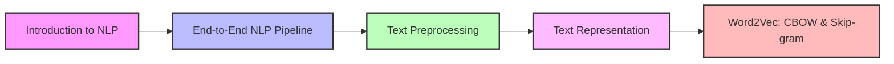

# 🚀 CampusX-NLP: Comprehensive NLP Learning Path 🧠

<div align="center">
  
  
  
</div>

## 📚 Course Overview

This repository contains comprehensive learning resources, notes, and implementations for the CampusX Natural Language Processing (NLP) course. Perfect for beginners and intermediate learners looking to master the fundamentals and applications of NLP.



## 📋 Course Contents

Full Playlist :- https://youtube.com/playlist?list=PLKnIA16_RmvZo7fp5kkIth6nRTeQQsjfX&si=wgfTnxQ8Uo22L2ax

| Session | Topic | Description | Resources | Blog |
|---------|-------|-------------|-----------|-----|
| 01 | **Introduction to NLP** | Fundamentals, applications, and challenges in NLP | [Notes](Sessions/01_Introduction%20to%20NLP.md) • [Video](https://youtu.be/zlUpTlaxAKI?si=eI8b0K7oFfeEA25N) | [Blog](https://medium.com/@yash.kavaiya3/the-evolution-and-impact-of-natural-language-processing-nlp-a-comprehensive-guide-a7b8be692db1) |
| 02 | **End-to-End NLP Pipeline** | Complete workflow from data acquisition to deployment | [Notes](Sessions/02_End_to_End_NLP_Pipeline.md) • [Video](https://youtu.be/29qyNyNkLHs?si=TZWdyoIDLS3hqi7c) |[Blog](https://medium.com/@yash.kavaiya3/the-nlp-pipeline-building-intelligence-into-language-processing-systems-43d8c69ed77c)|
| 03 | **Text Preprocessing** | Techniques for cleaning and preparing text data | [Notes](Sessions/03_Text%20Preprocessing.md) • [Video](https://youtu.be/6C0sLtw5ctc?si=nVRGd2lBT5NFemaR)|[Blog](https://medium.com/@yash.kavaiya3/the-nlp-engineers-guide-to-text-preprocessing-building-the-foundation-for-robust-language-models-0914270184ff)|
| 04 | **Text Representation** | Methods to convert text into machine-readable formats | [Notes](Sessions/04_Text%20Representation.md) • [Assignment](Sessions/04_assignment-lecture4.py) |[Blog](https://medium.com/@yash.kavaiya3/from-words-to-vectors-understanding-text-representation-in-nlp-f76b492fa2a5)|
| 05 | **Word2Vec Tutorial** | Comprehensive guide to CBOW and Skip-gram architectures | [Notes](Sessions/05_Word2vec_Complete_Tutorial_CBOW_and_Skip-gram.md) |[Blog] ()|

## 🎯 Learning Objectives

- 🧠 Understand core NLP concepts and terminology
- 🛠️ Master the end-to-end NLP pipeline from data collection to deployment
- 📊 Learn various text representation techniques (BOW, TF-IDF, Word Embeddings)
- 🔍 Implement preprocessing workflows for text data
- 🚀 Gain practical experience with modern NLP models and architectures
- 📈 Apply NLP techniques to real-world problems and use cases

## 💡 Key NLP Concepts Covered

<div align="center">

| Concept Category | Techniques & Topics |
|------------------|---------------------|
| **Text Processing** | Tokenization, Normalization, Stemming, Lemmatization |
| **Feature Engineering** | Bag-of-Words, TF-IDF, N-grams, Word Embeddings |
| **Embedding Models** | Word2Vec (CBOW, Skip-gram), GloVe, FastText |
| **ML/DL Approaches** | Traditional ML, Deep Learning, Transfer Learning |
| **Model Architectures** | RNNs, LSTMs, GRUs, Transformers, BERT |
| **Deployment** | Model serving, API development, Monitoring |

</div>

## 📝 Additional Resources

Each session includes:
- 📔 Comprehensive markdown notes with examples
- 🔗 Links to video lectures and external resources
- 📊 Diagrams and visualizations
- 💻 Code examples where applicable

## 🚀 Getting Started

1. **Clone the repository**
   ```bash
   git clone https://github.com/Yash-Kavaiya/CampusX-NLP.git
   cd CampusX-NLP
   ```

2. **Navigate through the sessions**
   - Begin with [Introduction to NLP](Sessions/01_Introduction%20to%20NLP.md)
   - Follow the sequential order of sessions for best learning experience

3. **Complete assignments**
   - Practice with the provided code examples
   - Implement the techniques on your own datasets

## 🔧 Prerequisites

- Basic understanding of Python programming
- Familiarity with machine learning concepts (recommended)
- Interest in natural language and text processing

## 🤝 Contributing

Contributions to improve notes, fix errors, or add resources are welcome!

1. Fork the repository
2. Create your feature branch (`git checkout -b feature/improvement`)
3. Commit your changes (`git commit -m 'Add some improvement'`)
4. Push to the branch (`git push origin feature/improvement`)
5. Open a Pull Request

## 📜 License

This educational content is available for personal learning and non-commercial use.

## 🙏 Acknowledgements

- [CampusX](https://www.youtube.com/@campusx-official) for creating the original course content
- All contributors and maintainers of this educational resource

---

<div align="center">
  <p><i>🌟 Happy Learning! 🌟</i></p>
</div>
