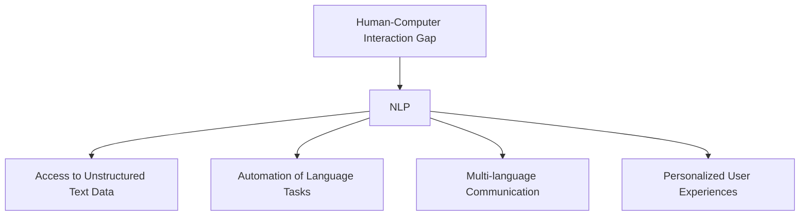
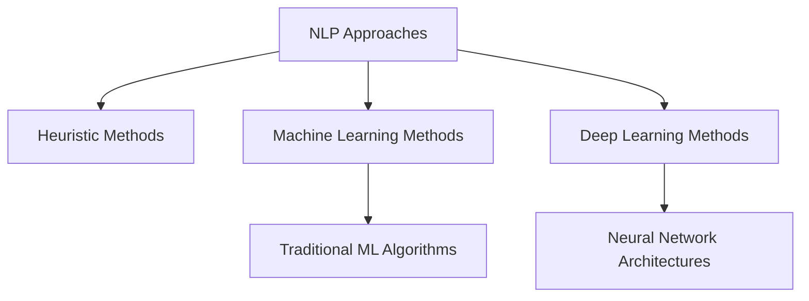

# Introduction to NLP 

# 🔍 Natural Language Processing (NLP) - Comprehensive Notes 📚

| Title | Link |
|-------|------|
| Introduction to NLP End to End NLP Course | [YouTube](https://youtu.be/zlUpTlaxAKI?si=eI8b0K7oFfeEA25N) |
| The Evolution and Impact of Natural Language Processing (NLP): A Comprehensive Guide | [Medium](https://medium.com/@yash.kavaiya3/the-evolution-and-impact-of-natural-language-processing-nlp-a-comprehensive-guide-a7b8be692db1) |

## 📘 What is NLP? 

Natural Language Processing (NLP) is a subfield at the intersection of:
- 💻 Computer Science
- 🧠 Artificial Intelligence
- 🔤 Linguistics

It focuses on enabling computers to understand, interpret, and generate human language in a valuable way.

> 💡 **Core Definition**: NLP is concerned with the interactions between computers and human language, specifically programming computers to process and analyze large amounts of natural language data.

### 🗣️ Human Language vs. Computer Language

| Human Language | Computer Language |
|----------------|-------------------|
| Evolved naturally through use | Consciously designed and planned |
| Ambiguous and context-dependent | Precise and deterministic |
| Constantly evolving | Changes through formal updates |
| Regional variations and dialects | Standardized across implementations |
| Rich with idioms and cultural context | Literal interpretation |

Natural languages have evolved without conscious planning and take different forms:
- 🗣️ Spoken language
- ✍️ Written text
- 👐 Sign language

## 🎯 Need For NLP

NLP bridges the gap between human communication and computer understanding by:
- 📊 Converting unstructured language data into structured insights
- 🔄 Enabling computers to understand human intent and context
- 🌐 Breaking down language barriers for global communication
- 🤖 Creating more intuitive and natural interfaces for technology

## 🌍 Real World Applications

| Application | NLP Functions | Examples |
|-------------|--------------|----------|
| 📢 **Contextual Advertisements** | Text classification, Sentiment analysis | Ad targeting based on content context |
| 📧 **Email Clients** | Spam filtering, Smart reply | Gmail's reply suggestions, Spam detection |
| 📱 **Social Media** | Content moderation, Opinion mining | Removing harmful content, Trend analysis |
| 🔍 **Search Engines** | Query understanding, Information retrieval | Google's semantic search |
| 💬 **Chatbots** | Intent recognition, Response generation | Customer service bots, Virtual assistants |
| 📝 **Document Analysis** | Text summarization, Topic modeling | Legal document analysis, Research papers |
| 🗣️ **Voice Assistants** | Speech recognition, Natural language understanding | Siri, Alexa, Google Assistant |

## 🛠️ Common NLP Tasks

### Text Processing Tasks
- 📊 **Text/Document Classification**: Categorizing documents by topic, intent, or content type
- 😊 **Sentiment Analysis**: Determining emotional tone of text (positive, negative, neutral)
- 🔎 **Information Retrieval**: Finding relevant information from large text collections
- 🏷️ **Named Entity Recognition**: Identifying names, locations, organizations in text

### Linguistic Analysis
- 📝 **Part of Speech Tagging**: Identifying nouns, verbs, adjectives, etc.
- 🌐 **Language Detection**: Identifying which language text is written in
- 🔄 **Machine Translation**: Converting text from one language to another
- 📊 **Text Parsing**: Analyzing grammatical structure of sentences

### Advanced Understanding
- 💡 **Knowledge Graphs & QA Systems**: Building semantic networks for question answering
- 📋 **Text Summarization**: Creating concise summaries of longer documents
- 📚 **Topic Modeling**: Discovering abstract topics within document collections
- ✍️ **Text Generation**: Creating human-like text based on prompts or inputs

### Text Enhancement
- ✅ **Spelling Check & Grammar Correction**: Identifying and fixing text errors
- 🔊 **Speech to Text**: Converting spoken language to written text
- 🗣️ **Text to Speech**: Converting written text to spoken language

## 🧩 Approaches to NLP

### 📐 Heuristic Approaches

> 💡 **Definition**: Rule-based methods that use manually crafted patterns and linguistic rules.

#### Key Heuristic Tools:
- 🔍 **Regular Expressions**: Pattern matching for text extraction and validation
- 📚 **WordNet**: Lexical database of semantic relationships between words
- 🧠 **Open Mind Common Sense**: Collection of common knowledge facts

#### Advantages:
- ✅ Works well for structured problems with clear rules
- ✅ No training data required
- ✅ Transparent and interpretable results
- ✅ Effective for specific, well-defined tasks

#### Limitations:
- ❌ Difficult to scale to complex problems
- ❌ Time-consuming to create and maintain rules
- ❌ Cannot easily handle exceptions and ambiguity
- ❌ Limited ability to generalize to new scenarios

### 🤖 Machine Learning Approach

> 💡 **Definition**: Statistical methods that learn patterns from data rather than following explicit rules.

#### The Big Advantage:
- 📈 Can identify patterns humans might miss
- 🔄 Adapts to new data without manual reprogramming
- 🌐 Better handles variations and exceptions in language

#### ML Workflow for NLP:
1. 📊 Data collection and preprocessing
2. 🔢 Feature extraction (bag of words, TF-IDF, n-grams)
3. 🧮 Model training and validation
4. 📝 Evaluation and tuning
5. 🚀 Deployment

#### Algorithms Used:
- 📊 **Naive Bayes**: Probabilistic classifier based on Bayes' theorem
- 📈 **Logistic Regression**: Models probability of categorical outcomes
- 🔍 **Support Vector Machines (SVM)**: Finds optimal boundary between classes
- 📑 **Latent Dirichlet Allocation (LDA)**: Topic modeling technique

### 🧠 Deep Learning Approach

> 💡 **Definition**: Advanced neural network architectures that can learn complex patterns and representations from large datasets.

#### The Big Advantage:
- 🔄 Automatically learns features from raw data
- 📊 Captures complex patterns and long-range dependencies
- 📈 Achieves state-of-the-art performance on most NLP tasks
- 🌐 Better handles context and semantic meaning

#### Architectures Used:
- 🔄 **Recurrent Neural Networks (RNN)**: Processes sequential data with memory
- 📝 **Long Short-Term Memory (LSTM)**: Advanced RNN that better captures long-term dependencies
- 🔍 **Gated Recurrent Units (GRU)**: Simplified LSTM with similar performance
- 📊 **Convolutional Neural Networks (CNN)**: Extracts local patterns in text
- 🌟 **Transformers**: Attention-based architecture that excels at capturing relationships (BERT, GPT)
- 🔄 **Autoencoders**: Learns compact representations of text data

## ⚠️ Challenges in NLP

| Challenge | Example | Difficulty |
|-----------|---------|------------|
| **Ambiguity** | "I saw the boy on the beach with my binoculars." (Who has the binoculars?) | High |
| **Contextual Words** | "I ran to the store because we ran out of milk." (Different meanings of "ran") | Medium |
| **Colloquialisms & Slang** | "Piece of cake" (Easy task, not actual cake) | High |
| **Synonyms** | Multiple words with same meaning | Medium |
| **Irony & Sarcasm** | "That's just what I needed today!" (Could be sincere or sarcastic) | Very High |
| **Spelling Errors** | "Pulliup ordecise seeking" | Medium |
| **Creativity** | Understanding poems, dialogue, metaphors | Very High |
| **Language Diversity** | Handling multiple languages and dialects | High |

### Specific Linguistic Challenges:

- 🔀 **Polysemy**: Words with multiple meanings
  - Example: "bank" (financial institution vs. river edge)

- 🤔 **Pragmatics**: Meaning beyond literal words
  - Example: "It's cold in here" (might be a request to close a window)

- 📚 **Cultural References**: Understanding culturally-specific content
  - Example: Sports metaphors, historical references

- 🔄 **Language Evolution**: Keeping up with new words and changing usage
  - Example: New internet slang, evolving terminology

- 🌐 **Multimodal Understanding**: Combining text with other data types
  - Example: Understanding text in images, video captions

---

## 📊 NLP Technology Evolution

> 💡 **Current Trends**: The field is rapidly advancing with multimodal models, few-shot learning, and increasingly sophisticated pre-trained language models that can be fine-tuned for specific tasks.