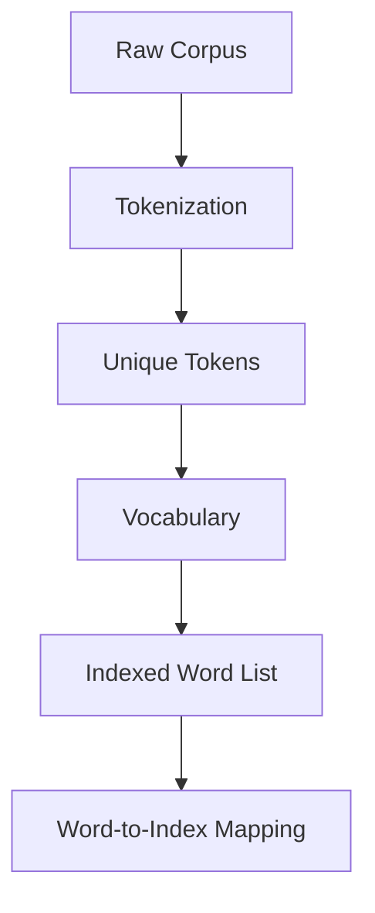
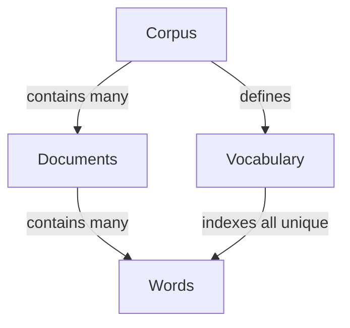
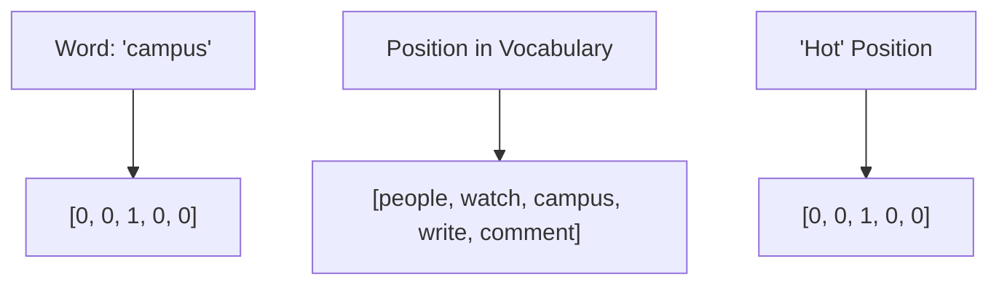
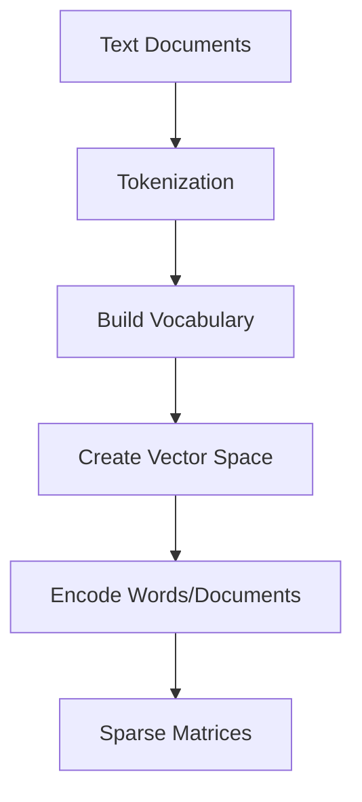
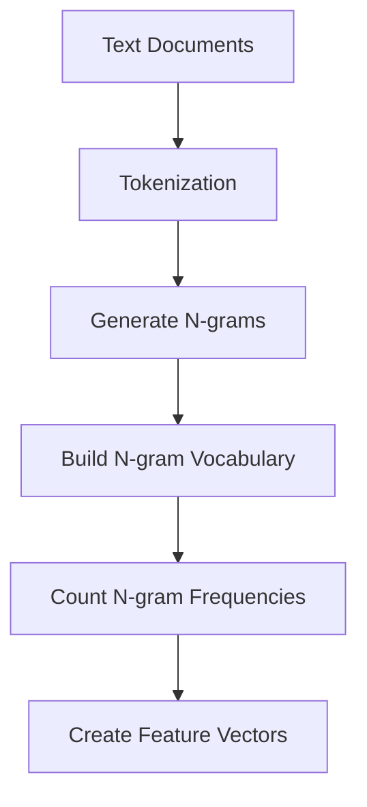
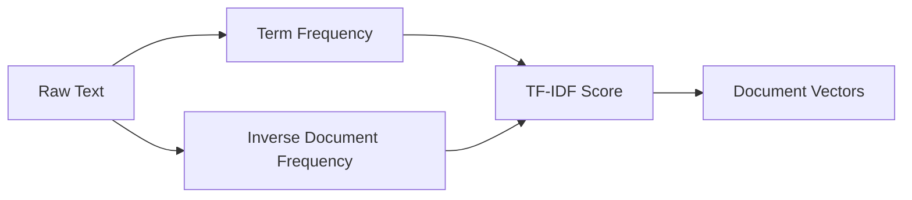
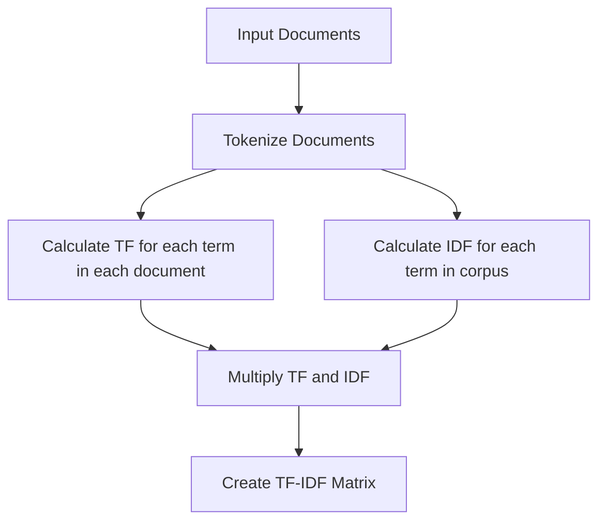
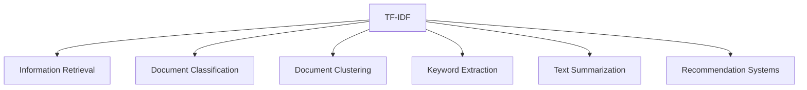

# Text Representation | NLP Lecture 4 | Bag of Words | Tf-Idf | N-grams, Bi-grams and Uni-grams

# Feature Extraction in NLP: Text Representation 📊🔤

## 1. What is Feature Extraction (Text Representation)? 🤔

**Feature extraction** in NLP is the process of transforming raw text data into numerical vectors that machine learning algorithms can understand and process. It's essentially a **translation mechanism** that converts human language into a mathematical format.

```
Raw Text → Feature Extraction → Numerical Representation
"I love NLP" → [Feature Extractor] → [0.2, 0.8, 0.3, ...]
```

> 💡 **Key Insight**: This transformation bridges the gap between human language and computational processing.

## 2. Why Do We Need Feature Extraction? 🎯

### Primary Reasons:

| Reason | Explanation |
|--------|-------------|
| **Algorithm Compatibility** | Machine learning algorithms require numerical inputs, not raw text |
| **Dimensionality Management** | Reduces the infinite space of language to manageable dimensions |
| **Pattern Recognition** | Enables algorithms to detect statistical patterns in language |
| **Computational Efficiency** | Makes processing large text corpora feasible |

### Without feature extraction:
```
"I love NLP" → ??? → ML Algorithm
                  ↑
                (No way to process)
```

## 3. Why is Feature Extraction Difficult? ⚠️

### Challenges in Text Representation:

- **Language Complexity** 📝
  - Ambiguity: "The bank was robbed" (financial institution or riverbank?)
  - Polysemy: Words with multiple meanings
  - Homonyms: Same spelling, different meanings

- **Contextual Meaning** 🔄
  - "It's cold" means different things in different contexts

- **Structural Information** 🏗️
  - Word order matters: "Dog bites man" ≠ "Man bites dog"
  - Syntactic relationships are crucial

- **Semantic Richness** 🌐
  - Capturing nuance, sentiment, and implied meanings

## 4. What is the Core Idea? 💡

The fundamental concept is **embedding** - mapping words or texts to points in a vector space where:

1. **Similar meanings → Similar vectors**
2. **Semantic relationships → Geometric relationships**
3. **Linguistic properties → Mathematical properties**

```
                Vector Space
                    ↑
"king" → [0.2, 0.6, ...] 
                    ↓ 
    Similar position to semantically similar words
```

## 5. What are the Techniques? 🛠️

### A. Traditional Methods

#### 1️⃣ **One-Hot Encoding**
```python
# Vocabulary: ["I", "love", "NLP", "machine", "learning"]
# "I love NLP" → [1, 1, 1, 0, 0]
```
- ✅ Simple
- ❌ No semantic information
- ❌ Sparse, high-dimensional

#### 2️⃣ **Bag-of-Words (BoW)**
```python
# "I love NLP" → {"I": 1, "love": 1, "NLP": 1}
# "I love machine learning" → {"I": 1, "love": 1, "machine": 1, "learning": 1}
```
- ✅ Simple frequency counting
- ❌ Loses word order
- ❌ No semantics

#### 3️⃣ **TF-IDF (Term Frequency-Inverse Document Frequency)**
```
TF-IDF(t, d) = TF(t, d) × IDF(t)
```
- ✅ Weights terms by importance
- ✅ Reduces impact of common words
- ❌ Still ignores word order

#### 4️⃣ **N-grams**
```
"I love NLP"
1-grams: ["I", "love", "NLP"]
2-grams: ["I love", "love NLP"]
```
- ✅ Captures some word order
- ❌ Sparsity increases exponentially

### B. Modern Embedding Techniques

#### 1️⃣ **Word Embeddings**

**Word2Vec**
```
"king" - "man" + "woman" ≈ "queen"
```
- ✅ Dense vectors
- ✅ Captures semantic relationships
- ❌ Single representation per word

**GloVe (Global Vectors)**
- ✅ Combines global statistics with local context
- ✅ Pre-trained on large corpora

**FastText**
- ✅ Handles out-of-vocabulary words
- ✅ Works with subword information

#### 2️⃣ **Contextual Embeddings**

**ELMo (Embeddings from Language Models)**
- ✅ Different vectors for same word in different contexts
- ✅ Bi-directional language model

**BERT (Bidirectional Encoder Representations from Transformers)**
```
"bank" in "river bank" ≠ "bank" in "financial bank"
```
- ✅ Deeply bidirectional
- ✅ Captures complex contextual relationships
- ✅ Pre-trained on massive corpora

**Transformer-based Models**
- GPT, RoBERTa, XLNet, T5
- ✅ State-of-the-art performance
- ✅ Self-attention mechanisms

## Summary: The Evolution of Text Representation 📈

```
One-Hot → Bag-of-Words → TF-IDF → Word2Vec → BERT
   ↓            ↓            ↓         ↓         ↓
Simple      Frequency     Weighted   Semantic   Contextual
```

### Key Takeaways:
- Feature extraction translates text into machine-readable format
- Techniques range from simple counting to complex neural models
- Modern methods preserve semantics, context, and relationships
- The field continues to evolve with transformer architectures

---

🔍 **Further Reading**: Word embeddings, Transformer architecture, Transfer learning in NLP

# 📚 Common Terms in NLP 🔤

## 1. Corpus 📊

A **corpus** is a large, structured collection of texts used for linguistic analysis and model training.

| 📋 Key Characteristics | 📝 Description |
|------------------------|----------------|
| 🔢 **Size** | Can range from thousands to billions of documents |
| 🌐 **Domain** | May be general (web text) or specialized (medical literature) |
| 🔄 **Format** | Usually stored in plain text or specialized formats |
| 📏 **Quality** | Can be raw or cleaned/preprocessed |

> 💡 **Practical Example**: *The Brown Corpus* was one of the first major electronic corpora, containing ~1 million words of American English texts published in 1961.

### Common Types of Corpora:
- 🌍 **General corpora**: Broad language samples (Wikipedia dumps, Common Crawl)
- 🎯 **Domain-specific corpora**: Focused on particular fields (PubMed, legal documents)
- 📣 **Parallel corpora**: Same content in multiple languages (Europarl)
- 🗣️ **Speech corpora**: Spoken language samples (LibriSpeech)

## 2. Vocabulary 📔

A **vocabulary** (or lexicon) is the complete set of unique tokens (usually words) that appear in a corpus.



| 📊 Vocabulary Considerations | 🔍 Impact |
|------------------------------|----------|
| 📈 **Size** | Larger vocabulary = more memory requirements, potential sparsity issues |
| 🧮 **Frequency cutoffs** | Removing rare words reduces vocabulary size |
| 🔠 **Case sensitivity** | "The" vs. "the" – separate entries or normalized? |
| ✂️ **Subword units** | Using pieces of words (WordPiece, BPE) for OOV handling |

> 💡 **Key Insight**: Vocabulary choice directly impacts feature extraction – it defines the dimensions of your vector space.

## 3. Document 📄

A **document** is a single text unit in a corpus, which can vary widely in length and structure.

| 📑 Document Types | 📏 Scale | 🔍 Examples |
|-------------------|----------|------------|
| 🔹 **Micro** | Very small | Tweet, search query, product title |
| 🔸 **Small** | Paragraph-sized | News headline, abstract, short comment |
| 📝 **Medium** | Article-sized | News article, essay, email, review |
| 📚 **Large** | Extended content | Research paper, book chapter, transcript |

### Document Representation:
- 📊 **Bag-of-words**: Document as word frequency vector
- 🧩 **Sequence**: Document as ordered tokens
- 🌐 **Graph**: Document as connected entity/concept network
- 🔢 **Dense vector**: Document as fixed-length embedding

## 4. Word 🔤

A **word** refers to a basic unit of language that carries meaning, though the definition becomes complex in computational contexts.

| 📝 Related Concept | 📋 Definition | 🔍 Example |
|-------------------|--------------|------------|
| 🧩 **Token** | Unit after text segmentation | "don't" → ["don", "'", "t"] |
| 🌱 **Stem** | Word with suffix removed | "running" → "run" |
| 📖 **Lemma** | Dictionary form of a word | "better" → "good" |
| 🔡 **Wordpiece** | Subword unit | "uncommon" → ["un", "common"] |

### Word Complexity Challenges:
- 🔀 **Compounds**: "ice cream" – one concept, two tokens?
- 🌉 **Multi-word expressions**: "New York City" – single entity
- ➖ **Hyphenation**: "state-of-the-art" – one word or multiple?
- 🔤 **Case sensitivity**: "apple" vs. "Apple" (fruit vs. company)
- 🌐 **Cross-lingual considerations**: Words in languages without clear word boundaries

---

## 🔄 Relationships Between Terms



# 🔢 One-Hot Encoding in NLP 📊

## What is One-Hot Encoding? 🎯

**One-hot encoding** is a representation technique that transforms categorical data into a binary vector format where:
- Each categorical value becomes a vector of 0s
- Exactly one position in the vector contains a 1 (hence "one-hot")
- The vector length equals the number of categories

> 💡 **Core Concept**: One-hot encoding creates a mathematical representation of words or documents that machines can process, sacrificing efficiency for simplicity and interpretability.

## 📋 Your Example Corpus Analysis

```
D1: people watch campus
D2: campus watch campus
D3: people write comment
D4: campus write comment

Vocabulary (V=5): [people, watch, campus, write, comment]
```

## 🔤 One-Hot Encoding of Words

In word-level one-hot encoding, each word is represented as a vector where only one position is "hot" (set to 1).

| Word | Vector Representation |
|------|----------------------|
| 🧑 **people** | [1, 0, 0, 0, 0] |
| 👁️ **watch** | [0, 1, 0, 0, 0] |
| 🏫 **campus** | [0, 0, 1, 0, 0] |
| ✍️ **write** | [0, 0, 0, 1, 0] |
| 💬 **comment** | [0, 0, 0, 0, 1] |

### 📊 Visual Representation



## 📄 One-Hot Encoding of Documents

### Binary Document Vectors (Presence/Absence)

When representing documents, one-hot encoding commonly uses a **binary bag-of-words** approach:

| Document | Content | Binary Vector |
|----------|---------|--------------|
| 📑 **D1** | "people watch campus" | [1, 1, 1, 0, 0] |
| 📑 **D2** | "campus watch campus" | [0, 1, 1, 0, 0] |
| 📑 **D3** | "people write comment" | [1, 0, 0, 1, 1] |
| 📑 **D4** | "campus write comment" | [0, 0, 1, 1, 1] |

### Count-Based Document Vectors (Frequency)

A more informative representation counts word occurrences:

| Document | people | watch | campus | write | comment |
|----------|--------|-------|--------|-------|---------|
| 📑 **D1** | 1 | 1 | 1 | 0 | 0 |
| 📑 **D2** | 0 | 1 | 2 | 0 | 0 |
| 📑 **D3** | 1 | 0 | 0 | 1 | 1 |
| 📑 **D4** | 0 | 0 | 1 | 1 | 1 |

> 🔍 **Note**: In D2, "campus" appears twice, so its count is 2 rather than 1 in the frequency-based representation.

## ⚙️ Implementation Process



## 🔍 Mathematical View

For a vocabulary of size V, word w<sub>i</sub> is represented as a vector x<sub>i</sub> ∈ ℝ<sup>V</sup> where:

$$x_i[j] = \begin{cases}
1 & \text{if } j = i \\
0 & \text{otherwise}
\end{cases}$$

## ✅ Advantages and ❌ Limitations

| Advantages | Limitations |
|------------|-------------|
| 🟢 Simple to implement | 🔴 High dimensionality (V-sized vectors) |
| 🟢 No assumptions about relationships | 🔴 Sparse representation (mostly zeros) |
| 🟢 Equal distance between all words | 🔴 No semantic information captured |
| 🟢 Interpretable dimensions | 🔴 Cannot handle out-of-vocabulary words |
| 🟢 Works with any ML algorithm | 🔴 Ignores word order and context |

## 🔄 Relationship to Other Text Representations

One-hot encoding serves as the foundation for more advanced representations:

- **TF-IDF**: Weighted version of document vectors
- **Co-occurrence matrices**: Built from one-hot vectors
- **Word embeddings**: Dense vectors that address sparsity issues
- **Topic models**: Use document-term matrices derived from one-hot representations

## 🧮 Sample Calculations with Your Corpus

### Document Similarity Using One-Hot Vectors

Let's compute similarity between documents using the binary representation:

```
Similarity(D1, D2) = Dot product([1,1,1,0,0], [0,1,1,0,0]) = 2
Similarity(D1, D3) = Dot product([1,1,1,0,0], [1,0,0,1,1]) = 1
```

> 💡 This simple analysis shows D1 and D2 share more common terms (2) than D1 and D3 (1).
# 📊 N-grams in NLP: Beyond Single Words 🔤

## 🔍 What Are N-grams?

**N-grams** are contiguous sequences of n items (words, characters, or tokens) from a text document. Unlike the standard Bag of Words model that treats each word individually, N-grams capture adjacent elements, preserving some of the sequential information in text.

> 💡 **Key Insight**: N-grams attempt to preserve local word order patterns that single-word models miss entirely.


## 🧩 Types of N-grams

| N-gram Type | Description | Example from "people watch campusx" |
|-------------|-------------|-----------------------------------|
| 🔹 **Unigrams** (n=1) | Single tokens | "people", "watch", "campusx" |
| 🔹 **Bigrams** (n=2) | Pairs of adjacent tokens | "people watch", "watch campusx" |
| 🔹 **Trigrams** (n=3) | Triplets of adjacent tokens | "people watch campusx" |
| 🔹 **4-grams** (n=4) | Four adjacent tokens | (none in this short example) |

## 🎯 Bigram Example from the Image

Your image shows how documents are represented using bigrams:

### 📋 Document Corpus
- D1: "people watch campusx"
- D2: "campusx watch campusx"
- D3: "people write comment"
- D4: "campusx write comment"

### 📊 Bigram Vocabulary (V=8)
1. "people watch"
2. "watch campusx"
3. "campusx watch"
4. "people write"
5. "write comment"
6. "campusx write"

### 📈 Bigram Document-Term Matrix

| Document | people watch | watch campusx | campusx watch | people write | write comment | campusx write |
|----------|--------------|---------------|---------------|--------------|---------------|---------------|
| D1       | 1            | 1             | 0             | 0            | 0             | 0             |
| D2       | 0            | 1             | 1             | 0            | 0             | 0             |
| D3       | 0            | 0             | 0             | 1            | 1             | 0             |
| D4       | 0            | 0             | 0             | 0            | 1             | 1             |

## ⚙️ Implementation Process



## 📐 Mathematical Representation

For a text with m tokens [w₁, w₂, ..., wₘ], the set of n-grams is:

$$\{(w_i, w_{i+1}, ..., w_{i+n-1}) \mid 1 \leq i \leq m-n+1\}$$

## ✅ Advantages of N-grams

| Advantage | Description | Impact |
|-----------|-------------|--------|
| 🌟 **Preserves Local Context** | Captures word order and phrases | Better semantic preservation than BOW |
| 🌟 **Language Model Foundation** | Basis for probabilistic language models | Enables text generation and prediction |
| 🌟 **Simple Implementation** | Straightforward extension of BOW | Easily integrated into existing pipelines |
| 🌟 **No Training Required** | Direct counting from corpus | Fast to implement compared to neural models |
| 🌟 **Handles Fixed Expressions** | Better representation of idioms, phrases | "New York" stays together as a concept |
| 🌟 **Improved Classification** | Often increases accuracy in text classification | Better features for ML algorithms |

## ❌ Disadvantages of N-grams

| Disadvantage | Description | Impact |
|--------------|-------------|--------|
| 🔴 **Exponential Vocabulary Growth** | Vocabulary size grows dramatically with n | Memory and computation costs increase |
| 🔴 **Data Sparsity** | Most n-grams appear very rarely | Sparse vectors with many zeros |
| 🔴 **Limited Context Window** | Only captures local patterns within n words | Misses long-range dependencies |
| 🔴 **Out-of-Vocabulary Problem** | Any unseen n-gram is completely missed | Poor generalization to new text |
| 🔴 **Rigid Sequence Matching** | Requires exact matches (no synonyms) | "very good" ≠ "really good" |
| 🔴 **No Semantic Understanding** | Still fundamentally a counting model | Misses deeper meaning |

## 🔍 N-gram Smoothing Techniques

To address the sparsity problem, several smoothing methods exist:

| Technique | Description | Benefit |
|-----------|-------------|---------|
| 🛠️ **Laplace (Add-1)** | Add 1 to all counts | Simple but often overestimates rare events |
| 🛠️ **Add-k** | Add k (fraction) to all counts | More flexible than Add-1 |
| 🛠️ **Good-Turing** | Reallocate probability mass | Better estimates for rare events |
| 🛠️ **Kneser-Ney** | Uses absolute discounting | State-of-the-art for n-gram models |
| 🛠️ **Backoff Models** | Fall back to (n-1)-grams when n-gram unseen | More robust predictions |

## 📊 Comparing N-gram Models

| Model | Context Captured | Vector Space Size | Sparsity | Common Applications |
|-------|------------------|-------------------|----------|---------------------|
| 🔹 **Unigrams** | None | V | Low | Topic classification, basic IR |
| 🔹 **Bigrams** | 1 previous word | V² (potential) | Medium | Phrase detection, basic context |
| 🔹 **Trigrams** | 2 previous words | V³ (potential) | High | Language modeling, speech recognition |
| 🔹 **4-grams+** | 3+ previous words | V^n (potential) | Very High | Specialized language modeling |

## 🚀 Applications of N-grams

| Application | How N-grams Are Used | Why It Works |
|-------------|----------------------|-------------|
| 📝 **Language Identification** | Character n-grams frequencies | Languages have distinct n-gram patterns |
| 🔤 **Spelling Correction** | Character n-gram probability | Likely character sequences guide corrections |
| 🎯 **Text Classification** | Word n-gram features | Phrases provide better classification signals |
| 🔍 **Information Retrieval** | Query-document n-gram matching | Multi-word queries match better |
| 📊 **Language Modeling** | Predict next word from previous n-1 words | Statistical patterns in language |
| 🧠 **Machine Translation** | Phrase-based translation | Better than word-by-word translation |

## 🧮 Character N-grams vs. Word N-grams

| Type | Advantages | Common Uses |
|------|------------|------------|
| 🔤 **Character N-grams** | • Handles misspellings<br>• Smaller vocabulary<br>• Works across languages | • Language ID<br>• Authorship analysis<br>• Spam detection |
| 📚 **Word N-grams** | • Captures meaningful phrases<br>• Better semantic representation<br>• More intuitive | • Topic modeling<br>• Sentiment analysis<br>• Text generation |

## 🌐 N-grams in Modern NLP

While deep learning approaches have surpassed n-grams in performance for many NLP tasks, n-grams still remain relevant:

- 🔹 As features in hybrid systems
- 🔹 In resource-constrained environments
- 🔹 For interpretable models where feature importance matters
- 🔹 As baselines for comparing more complex models

> 💡 **Evolution of Context Capture**: N-grams → RNNs → Attention → Transformers

## 🧩 Code Example: Generating N-grams

```python
def generate_ngrams(text, n):
    # Tokenize the text
    tokens = text.lower().split()
    
    # Generate n-grams
    ngrams = []
    for i in range(len(tokens) - n + 1):
        ngram = ' '.join(tokens[i:i+n])
        ngrams.append(ngram)
    
    return ngrams

# Example
text = "people watch campusx"
print(generate_ngrams(text, 2))  # Outputs: ['people watch', 'watch campusx']
```

## 🌟 The Big Picture: N-grams as Feature Extraction

N-grams represent a crucial bridge between the simplicity of Bag-of-Words and more sophisticated context-aware models. While they cannot capture long-range dependencies or true semantic understanding, their ability to preserve local word order makes them a significant improvement over single-word models.

---

N-grams balance the trade-off between model complexity and contextual awareness, providing a robust framework that remains relevant even in today's deep learning-dominated NLP landscape.

# 📊 TF-IDF: Term Frequency-Inverse Document Frequency 📚

## 🔍 What is TF-IDF?

**TF-IDF** (Term Frequency-Inverse Document Frequency) is a numerical statistic that reflects the importance of a word to a document in a collection of documents (corpus). It's one of the most powerful feature extraction techniques in NLP.

> 💡 **Core Insight**: Not all words are created equal. TF-IDF increases the weight of terms that are frequent in a document but rare across the corpus, helping identify distinctive terms.



## 🧮 Mathematical Formulation

TF-IDF consists of two components multiplied together:

$$\text{TF-IDF}(t, d, D) = \text{TF}(t, d) \times \text{IDF}(t, D)$$

Where:
- t = term (word)
- d = document
- D = collection of documents (corpus)

### 📈 Term Frequency (TF)

TF measures how frequently a term occurs in a document:

$$\text{TF}(t, d) = \frac{\text{Number of times term t appears in document d}}{\text{Total number of terms in document d}}$$

### 📉 Inverse Document Frequency (IDF)

IDF measures how important a term is across the entire corpus:

$$\text{IDF}(t, D) = \log\left(\frac{\text{Total number of documents in corpus}}{\text{Number of documents containing term t}}\right)$$

> 🔑 **Key Point**: The logarithm dampens the effect of IDF for very rare terms.

## ⚙️ Calculating TF-IDF: Step-by-Step Process



### 1️⃣ Calculate Term Frequency (TF)

For each term in each document:

| TF Calculation Methods | Formula | Notes |
|------------------------|---------|-------|
| 🔹 **Raw Count** | TF(t,d) = f(t,d) | Simple count of term occurrences |
| 🔹 **Boolean Frequency** | TF(t,d) = 1 if t occurs in d, 0 otherwise | Just indicates presence |
| 🔹 **Term Frequency** | TF(t,d) = f(t,d) / ∑f(t',d) | Normalized by document length |
| 🔹 **Log Normalization** | TF(t,d) = 1 + log(f(t,d)) | Dampens effect of high-frequency terms |
| 🔹 **Double Normalization** | TF(t,d) = 0.5 + 0.5 * f(t,d) / max_t'(f(t',d)) | Scales between 0.5 and 1 |

### 2️⃣ Calculate Inverse Document Frequency (IDF)

For each term across all documents:

| IDF Calculation Methods | Formula | Notes |
|-------------------------|---------|-------|
| 🔹 **Standard IDF** | IDF(t) = log(N / df(t)) | N = total docs, df = docs containing t |
| 🔹 **Smooth IDF** | IDF(t) = log(1 + N / df(t)) | Prevents division by zero |
| 🔹 **Probabilistic IDF** | IDF(t) = log((N - df(t)) / df(t)) | Derived from probabilistic model |

### 3️⃣ Calculate TF-IDF

For each term in each document, multiply TF and IDF.

## 📊 Practical Example

Let's work through a simple example using our corpus from previous examples:

| Document | Content |
|----------|---------|
| 📑 **D1** | "people watch campusx" |
| 📑 **D2** | "campusx watch campusx" |
| 📑 **D3** | "people write comment" |
| 📑 **D4** | "campusx write comment" |

### Step 1: Calculate Term Frequency (TF)

| Term | TF in D1 | TF in D2 | TF in D3 | TF in D4 |
|------|----------|----------|----------|----------|
| people | 1/3 = 0.33 | 0 | 1/3 = 0.33 | 0 |
| watch | 1/3 = 0.33 | 1/3 = 0.33 | 0 | 0 |
| campusx | 1/3 = 0.33 | 2/3 = 0.67 | 0 | 1/3 = 0.33 |
| write | 0 | 0 | 1/3 = 0.33 | 1/3 = 0.33 |
| comment | 0 | 0 | 1/3 = 0.33 | 1/3 = 0.33 |

### Step 2: Calculate Document Frequency (DF) and IDF

| Term | DF | IDF = log(4/DF) |
|------|----|--------------------|
| people | 2 | log(4/2) = log(2) ≈ 0.301 |
| watch | 2 | log(4/2) = log(2) ≈ 0.301 |
| campusx | 3 | log(4/3) ≈ 0.125 |
| write | 2 | log(4/2) = log(2) ≈ 0.301 |
| comment | 2 | log(4/2) = log(2) ≈ 0.301 |

### Step 3: Calculate TF-IDF

| Term | TF-IDF in D1 | TF-IDF in D2 | TF-IDF in D3 | TF-IDF in D4 |
|------|--------------|--------------|--------------|--------------|
| people | 0.33 × 0.301 ≈ 0.099 | 0 | 0.33 × 0.301 ≈ 0.099 | 0 |
| watch | 0.33 × 0.301 ≈ 0.099 | 0.33 × 0.301 ≈ 0.099 | 0 | 0 |
| campusx | 0.33 × 0.125 ≈ 0.041 | 0.67 × 0.125 ≈ 0.084 | 0 | 0.33 × 0.125 ≈ 0.041 |
| write | 0 | 0 | 0.33 × 0.301 ≈ 0.099 | 0.33 × 0.301 ≈ 0.099 |
| comment | 0 | 0 | 0.33 × 0.301 ≈ 0.099 | 0.33 × 0.301 ≈ 0.099 |

### Resulting TF-IDF Document Vectors

```
D1: [0.099, 0.099, 0.041, 0, 0]
D2: [0, 0.099, 0.084, 0, 0]
D3: [0.099, 0, 0, 0.099, 0.099]
D4: [0, 0, 0.041, 0.099, 0.099]
```

## 🔍 Interpreting TF-IDF Values

| Value Range | Interpretation | Example |
|-------------|----------------|---------|
| 🔼 **High TF-IDF** | Term is important and distinctive to this document | "campusx" in D2 has highest value (appears multiple times but not in all docs) |
| 🔽 **Low TF-IDF** | Term is either rare in the document or common across documents | Common terms or rarely used terms |
| 0️⃣ **Zero TF-IDF** | Term doesn't appear in the document | "write" in D1 and D2 |

## ✅ Advantages of TF-IDF

| Advantage | Description | Impact |
|-----------|-------------|--------|
| 🌟 **Importance Weighting** | Distinguishes between important and common terms | Better document representation |
| 🌟 **Noise Reduction** | Reduces impact of frequently occurring but less informative words | Cleaner feature space |
| 🌟 **Simple Yet Effective** | Computationally efficient with good results | Industry standard for decades |
| 🌟 **No Training Required** | Direct calculation from corpus statistics | Can be applied immediately to any dataset |
| 🌟 **Interpretable** | Values have clear meaning | Useful for feature analysis and selection |
| 🌟 **Domain Adaptability** | Automatically adjusts to domain-specific terminology | Works across various text types |

## ❌ Disadvantages of TF-IDF

| Disadvantage | Description | Impact |
|--------------|-------------|--------|
| 🔴 **Ignores Semantics** | Doesn't capture meaning or relationships between words | Semantic similarity not represented |
| 🔴 **Ignores Word Order** | Bag-of-words approach loses sequential information | Context is lost |
| 🔴 **High Dimensionality** | Feature space grows with vocabulary size | Curse of dimensionality issues |
| 🔴 **Sparse Vectors** | Most entries are zero | Computational efficiency challenges |
| 🔴 **Limited Context** | No consideration of document or corpus structure | Misses hierarchical information |
| 🔴 **Requires Preprocessing** | Sensitive to stemming, stopword removal choices | Results depend on preprocessing steps |

## 🚀 Common Applications of TF-IDF



| Application | How TF-IDF Is Used | Why It's Effective |
|-------------|-------------------|-------------------|
| 🔍 **Search Engines** | Ranking documents by query term importance | Prioritizes distinctive matches over common term matches |
| 📊 **Topic Modeling** | Identifying distinctive terms for topics | Highlights discriminative features |
| 🧮 **Document Similarity** | Computing cosine similarity between TF-IDF vectors | Better than raw word count similarity |
| 📑 **Text Summarization** | Identifying sentences with high TF-IDF words | Captures key content |
| 🏷️ **Keyword Extraction** | Words with highest TF-IDF scores become keywords | Identifies distinctive terms |

## 🌐 Extensions and Variations

| Variation | Description | Advantage Over Basic TF-IDF |
|-----------|-------------|----------------------------|
| 📊 **BM25** (Okapi BM25) | Probabilistic extension with length normalization | Better handles long documents |
| 📈 **Pivoted Length Normalization** | Adjusts for document length bias | More fair comparison across different document lengths |
| 🧠 **LSI/LSA** | Applies SVD to TF-IDF matrix | Captures latent semantic structure |
| 🧮 **Delta TF-IDF** | Compares TF-IDF across different corpora | Identifies distinctive terms between collections |
| 🔄 **TF-PDF** | Term Frequency-Proportional Document Frequency | Alternative to IDF for short texts |

## 💻 Implementation Example (Python)

```python
from sklearn.feature_extraction.text import TfidfVectorizer

# Our corpus
corpus = [
    "people watch campusx",
    "campusx watch campusx",
    "people write comment",
    "campusx write comment"
]

# Create TF-IDF Vectorizer
vectorizer = TfidfVectorizer()

# Transform documents to TF-IDF features
tfidf_matrix = vectorizer.fit_transform(corpus)

# Get feature names
feature_names = vectorizer.get_feature_names_out()

# Print results
for i, doc in enumerate(corpus):
    print(f"Document {i+1}: {doc}")
    # Get non-zero features for this document
    feature_index = tfidf_matrix[i,:].nonzero()[1]
    tfidf_scores = zip(feature_index, [tfidf_matrix[i, x] for x in feature_index])
    # Sort by score
    for idx, score in sorted(tfidf_scores, key=lambda x: x[1], reverse=True):
        print(f"  {feature_names[idx]}: {score:.6f}")
```

## 🔄 TF-IDF vs. Other Text Representation Methods

| Method | Captures Word Importance | Captures Semantics | Dimensionality | Training Required |
|--------|-------------------------|-------------------|---------------|-------------------|
| 📊 **Bag of Words** | ❌ | ❌ | High (V) | ❌ |
| 📈 **TF-IDF** | ✅ | ❌ | High (V) | ❌ |
| 🔤 **Word Embeddings** | ❌ | ✅ | Low (300-500) | ✅ |
| 🧠 **Topic Models** | ✅ | ✅ | Low (topics) | ✅ |
| 🔄 **Transformers** | ✅ | ✅ | Medium | ✅ |

## 🌟 Evolution in NLP: From TF-IDF to Modern Approaches


Despite its limitations, TF-IDF remains a foundational technique in NLP. Its computational efficiency, interpretability, and effectiveness make it a valuable tool for many text analysis tasks, even in the era of deep learning and transformer models.

> 💡 **Final Insight**: TF-IDF strikes an elegant balance between simplicity and effectiveness. While newer methods can capture more semantic nuance, TF-IDF's combination of local (TF) and global (IDF) statistics provides a remarkably powerful representation with minimal computational cost.

