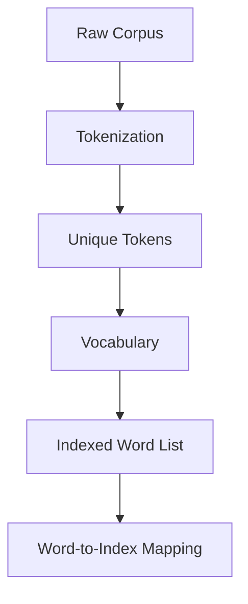
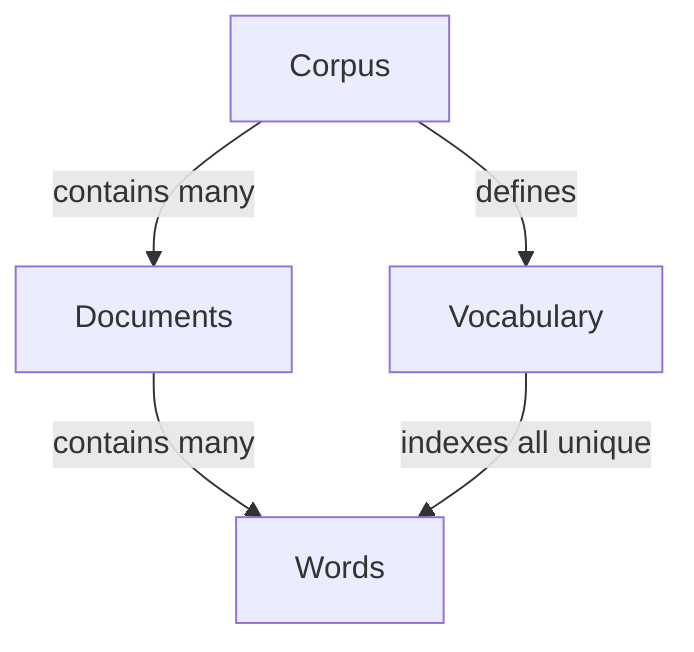
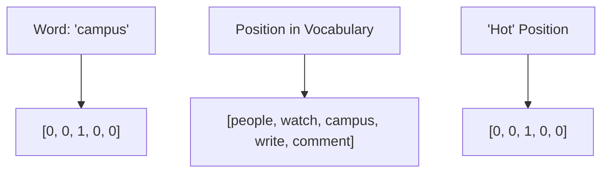
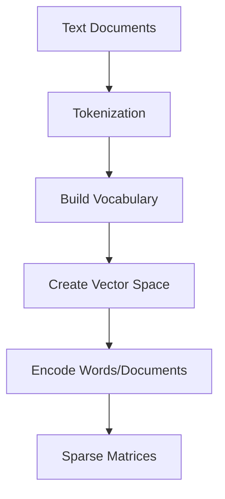

# Text Representation | NLP Lecture 4 | Bag of Words | Tf-Idf | N-grams, Bi-grams and Uni-grams

# Feature Extraction in NLP: Text Representation 📊🔤

## 1. What is Feature Extraction (Text Representation)? 🤔

**Feature extraction** in NLP is the process of transforming raw text data into numerical vectors that machine learning algorithms can understand and process. It's essentially a **translation mechanism** that converts human language into a mathematical format.

```
Raw Text → Feature Extraction → Numerical Representation
"I love NLP" → [Feature Extractor] → [0.2, 0.8, 0.3, ...]
```

> 💡 **Key Insight**: This transformation bridges the gap between human language and computational processing.

## 2. Why Do We Need Feature Extraction? 🎯

### Primary Reasons:

| Reason | Explanation |
|--------|-------------|
| **Algorithm Compatibility** | Machine learning algorithms require numerical inputs, not raw text |
| **Dimensionality Management** | Reduces the infinite space of language to manageable dimensions |
| **Pattern Recognition** | Enables algorithms to detect statistical patterns in language |
| **Computational Efficiency** | Makes processing large text corpora feasible |

### Without feature extraction:
```
"I love NLP" → ??? → ML Algorithm
                  ↑
                (No way to process)
```

## 3. Why is Feature Extraction Difficult? ⚠️

### Challenges in Text Representation:

- **Language Complexity** 📝
  - Ambiguity: "The bank was robbed" (financial institution or riverbank?)
  - Polysemy: Words with multiple meanings
  - Homonyms: Same spelling, different meanings

- **Contextual Meaning** 🔄
  - "It's cold" means different things in different contexts

- **Structural Information** 🏗️
  - Word order matters: "Dog bites man" ≠ "Man bites dog"
  - Syntactic relationships are crucial

- **Semantic Richness** 🌐
  - Capturing nuance, sentiment, and implied meanings

## 4. What is the Core Idea? 💡

The fundamental concept is **embedding** - mapping words or texts to points in a vector space where:

1. **Similar meanings → Similar vectors**
2. **Semantic relationships → Geometric relationships**
3. **Linguistic properties → Mathematical properties**

```
                Vector Space
                    ↑
"king" → [0.2, 0.6, ...] 
                    ↓ 
    Similar position to semantically similar words
```

## 5. What are the Techniques? 🛠️

### A. Traditional Methods

#### 1️⃣ **One-Hot Encoding**
```python
# Vocabulary: ["I", "love", "NLP", "machine", "learning"]
# "I love NLP" → [1, 1, 1, 0, 0]
```
- ✅ Simple
- ❌ No semantic information
- ❌ Sparse, high-dimensional

#### 2️⃣ **Bag-of-Words (BoW)**
```python
# "I love NLP" → {"I": 1, "love": 1, "NLP": 1}
# "I love machine learning" → {"I": 1, "love": 1, "machine": 1, "learning": 1}
```
- ✅ Simple frequency counting
- ❌ Loses word order
- ❌ No semantics

#### 3️⃣ **TF-IDF (Term Frequency-Inverse Document Frequency)**
```
TF-IDF(t, d) = TF(t, d) × IDF(t)
```
- ✅ Weights terms by importance
- ✅ Reduces impact of common words
- ❌ Still ignores word order

#### 4️⃣ **N-grams**
```
"I love NLP"
1-grams: ["I", "love", "NLP"]
2-grams: ["I love", "love NLP"]
```
- ✅ Captures some word order
- ❌ Sparsity increases exponentially

### B. Modern Embedding Techniques

#### 1️⃣ **Word Embeddings**

**Word2Vec**
```
"king" - "man" + "woman" ≈ "queen"
```
- ✅ Dense vectors
- ✅ Captures semantic relationships
- ❌ Single representation per word

**GloVe (Global Vectors)**
- ✅ Combines global statistics with local context
- ✅ Pre-trained on large corpora

**FastText**
- ✅ Handles out-of-vocabulary words
- ✅ Works with subword information

#### 2️⃣ **Contextual Embeddings**

**ELMo (Embeddings from Language Models)**
- ✅ Different vectors for same word in different contexts
- ✅ Bi-directional language model

**BERT (Bidirectional Encoder Representations from Transformers)**
```
"bank" in "river bank" ≠ "bank" in "financial bank"
```
- ✅ Deeply bidirectional
- ✅ Captures complex contextual relationships
- ✅ Pre-trained on massive corpora

**Transformer-based Models**
- GPT, RoBERTa, XLNet, T5
- ✅ State-of-the-art performance
- ✅ Self-attention mechanisms

## Summary: The Evolution of Text Representation 📈

```
One-Hot → Bag-of-Words → TF-IDF → Word2Vec → BERT
   ↓            ↓            ↓         ↓         ↓
Simple      Frequency     Weighted   Semantic   Contextual
```

### Key Takeaways:
- Feature extraction translates text into machine-readable format
- Techniques range from simple counting to complex neural models
- Modern methods preserve semantics, context, and relationships
- The field continues to evolve with transformer architectures

---

🔍 **Further Reading**: Word embeddings, Transformer architecture, Transfer learning in NLP

# 📚 Common Terms in NLP 🔤

## 1. Corpus 📊

A **corpus** is a large, structured collection of texts used for linguistic analysis and model training.

| 📋 Key Characteristics | 📝 Description |
|------------------------|----------------|
| 🔢 **Size** | Can range from thousands to billions of documents |
| 🌐 **Domain** | May be general (web text) or specialized (medical literature) |
| 🔄 **Format** | Usually stored in plain text or specialized formats |
| 📏 **Quality** | Can be raw or cleaned/preprocessed |

> 💡 **Practical Example**: *The Brown Corpus* was one of the first major electronic corpora, containing ~1 million words of American English texts published in 1961.

### Common Types of Corpora:
- 🌍 **General corpora**: Broad language samples (Wikipedia dumps, Common Crawl)
- 🎯 **Domain-specific corpora**: Focused on particular fields (PubMed, legal documents)
- 📣 **Parallel corpora**: Same content in multiple languages (Europarl)
- 🗣️ **Speech corpora**: Spoken language samples (LibriSpeech)

## 2. Vocabulary 📔

A **vocabulary** (or lexicon) is the complete set of unique tokens (usually words) that appear in a corpus.



| 📊 Vocabulary Considerations | 🔍 Impact |
|------------------------------|----------|
| 📈 **Size** | Larger vocabulary = more memory requirements, potential sparsity issues |
| 🧮 **Frequency cutoffs** | Removing rare words reduces vocabulary size |
| 🔠 **Case sensitivity** | "The" vs. "the" – separate entries or normalized? |
| ✂️ **Subword units** | Using pieces of words (WordPiece, BPE) for OOV handling |

> 💡 **Key Insight**: Vocabulary choice directly impacts feature extraction – it defines the dimensions of your vector space.

## 3. Document 📄

A **document** is a single text unit in a corpus, which can vary widely in length and structure.

| 📑 Document Types | 📏 Scale | 🔍 Examples |
|-------------------|----------|------------|
| 🔹 **Micro** | Very small | Tweet, search query, product title |
| 🔸 **Small** | Paragraph-sized | News headline, abstract, short comment |
| 📝 **Medium** | Article-sized | News article, essay, email, review |
| 📚 **Large** | Extended content | Research paper, book chapter, transcript |

### Document Representation:
- 📊 **Bag-of-words**: Document as word frequency vector
- 🧩 **Sequence**: Document as ordered tokens
- 🌐 **Graph**: Document as connected entity/concept network
- 🔢 **Dense vector**: Document as fixed-length embedding

## 4. Word 🔤

A **word** refers to a basic unit of language that carries meaning, though the definition becomes complex in computational contexts.

| 📝 Related Concept | 📋 Definition | 🔍 Example |
|-------------------|--------------|------------|
| 🧩 **Token** | Unit after text segmentation | "don't" → ["don", "'", "t"] |
| 🌱 **Stem** | Word with suffix removed | "running" → "run" |
| 📖 **Lemma** | Dictionary form of a word | "better" → "good" |
| 🔡 **Wordpiece** | Subword unit | "uncommon" → ["un", "common"] |

### Word Complexity Challenges:
- 🔀 **Compounds**: "ice cream" – one concept, two tokens?
- 🌉 **Multi-word expressions**: "New York City" – single entity
- ➖ **Hyphenation**: "state-of-the-art" – one word or multiple?
- 🔤 **Case sensitivity**: "apple" vs. "Apple" (fruit vs. company)
- 🌐 **Cross-lingual considerations**: Words in languages without clear word boundaries

---

## 🔄 Relationships Between Terms



# 🔢 One-Hot Encoding in NLP 📊

## What is One-Hot Encoding? 🎯

**One-hot encoding** is a representation technique that transforms categorical data into a binary vector format where:
- Each categorical value becomes a vector of 0s
- Exactly one position in the vector contains a 1 (hence "one-hot")
- The vector length equals the number of categories

> 💡 **Core Concept**: One-hot encoding creates a mathematical representation of words or documents that machines can process, sacrificing efficiency for simplicity and interpretability.

## 📋 Your Example Corpus Analysis

```
D1: people watch campus
D2: campus watch campus
D3: people write comment
D4: campus write comment

Vocabulary (V=5): [people, watch, campus, write, comment]
```

## 🔤 One-Hot Encoding of Words

In word-level one-hot encoding, each word is represented as a vector where only one position is "hot" (set to 1).

| Word | Vector Representation |
|------|----------------------|
| 🧑 **people** | [1, 0, 0, 0, 0] |
| 👁️ **watch** | [0, 1, 0, 0, 0] |
| 🏫 **campus** | [0, 0, 1, 0, 0] |
| ✍️ **write** | [0, 0, 0, 1, 0] |
| 💬 **comment** | [0, 0, 0, 0, 1] |

### 📊 Visual Representation



## 📄 One-Hot Encoding of Documents

### Binary Document Vectors (Presence/Absence)

When representing documents, one-hot encoding commonly uses a **binary bag-of-words** approach:

| Document | Content | Binary Vector |
|----------|---------|--------------|
| 📑 **D1** | "people watch campus" | [1, 1, 1, 0, 0] |
| 📑 **D2** | "campus watch campus" | [0, 1, 1, 0, 0] |
| 📑 **D3** | "people write comment" | [1, 0, 0, 1, 1] |
| 📑 **D4** | "campus write comment" | [0, 0, 1, 1, 1] |

### Count-Based Document Vectors (Frequency)

A more informative representation counts word occurrences:

| Document | people | watch | campus | write | comment |
|----------|--------|-------|--------|-------|---------|
| 📑 **D1** | 1 | 1 | 1 | 0 | 0 |
| 📑 **D2** | 0 | 1 | 2 | 0 | 0 |
| 📑 **D3** | 1 | 0 | 0 | 1 | 1 |
| 📑 **D4** | 0 | 0 | 1 | 1 | 1 |

> 🔍 **Note**: In D2, "campus" appears twice, so its count is 2 rather than 1 in the frequency-based representation.

## ⚙️ Implementation Process



## 🔍 Mathematical View

For a vocabulary of size V, word w<sub>i</sub> is represented as a vector x<sub>i</sub> ∈ ℝ<sup>V</sup> where:

$$x_i[j] = \begin{cases}
1 & \text{if } j = i \\
0 & \text{otherwise}
\end{cases}$$

## ✅ Advantages and ❌ Limitations

| Advantages | Limitations |
|------------|-------------|
| 🟢 Simple to implement | 🔴 High dimensionality (V-sized vectors) |
| 🟢 No assumptions about relationships | 🔴 Sparse representation (mostly zeros) |
| 🟢 Equal distance between all words | 🔴 No semantic information captured |
| 🟢 Interpretable dimensions | 🔴 Cannot handle out-of-vocabulary words |
| 🟢 Works with any ML algorithm | 🔴 Ignores word order and context |

## 🔄 Relationship to Other Text Representations

One-hot encoding serves as the foundation for more advanced representations:

- **TF-IDF**: Weighted version of document vectors
- **Co-occurrence matrices**: Built from one-hot vectors
- **Word embeddings**: Dense vectors that address sparsity issues
- **Topic models**: Use document-term matrices derived from one-hot representations

## 🧮 Sample Calculations with Your Corpus

### Document Similarity Using One-Hot Vectors

Let's compute similarity between documents using the binary representation:

```
Similarity(D1, D2) = Dot product([1,1,1,0,0], [0,1,1,0,0]) = 2
Similarity(D1, D3) = Dot product([1,1,1,0,0], [1,0,0,1,1]) = 1
```

> 💡 This simple analysis shows D1 and D2 share more common terms (2) than D1 and D3 (1).


